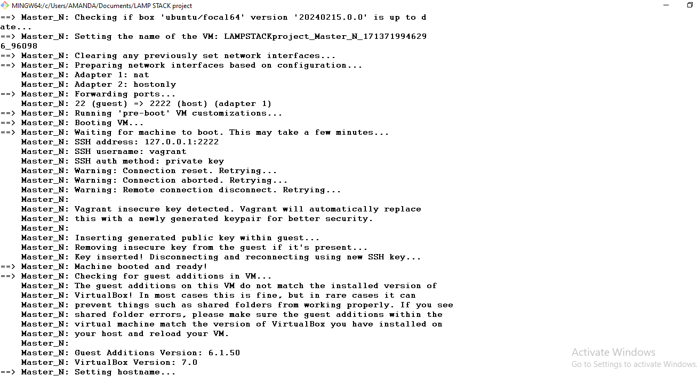
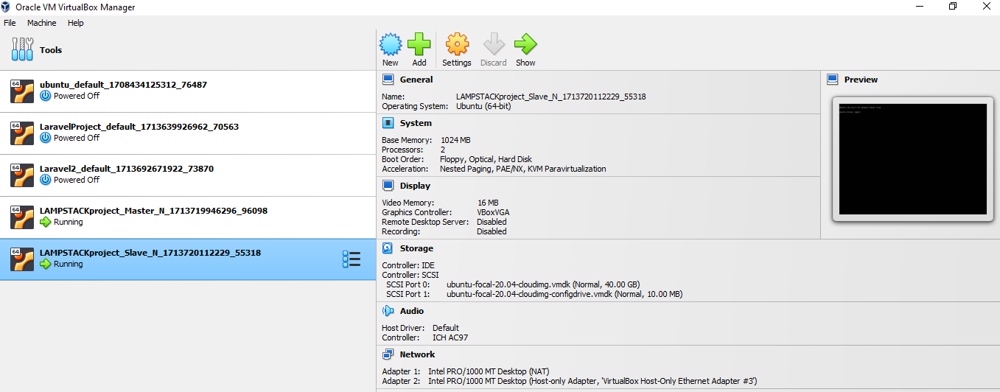

# CLOUD ENGINEERING SECOND SEMESTER EXAMINATION PROJECT

Objective:

### STAGE 1:

PART A
 ## Automate the provisioning of two Ubuntu-based servers, named “Master” and “Slave”, using Vagrant.

 Soln:

```bash
# -*- mode: ruby -*-
# vi: set ft=ruby :

Vagrant.configure("2") do |config|
  config.hostmanager.enabled = true 
  config.hostmanager.manage_host = true
  
  ### Master vm  ####
  config.vm.define "Master_N" do |master_n|
    master_n.vm.box = "ubuntu/focal64"
    master_n.vm.hostname = "MasterNode"
    master_n.vm.network "private_network", ip: "192.168.33.23"
    master_n.vm.provider "virtualbox" do |vb|
    end
  end
  
  ### Slave Node vm  #### 
  config.vm.define "Slave_N" do |slave_n|
    slave_n.vm.box = "ubuntu/focal64"
    slave_n.vm.hostname = "SlaveNode"
    slave_n.vm.network "private_network", ip: "192.168.32.22"
    slave_n.vm.provider "virtualbox" do |vb|
    end
  end
  
end

```






PART B

## On the Master node, create a bash script to automate the deployment of a LAMP (Linux, Apache, MySQL, PHP) stack. This script should clone a PHP application from GitHub, install all necessary packages, and configure Apache web server and MySQL. 

 Soln:


As you can see from the screenshot above, a ping of the slave node IP address was sucessful. With public and private keys generated.


### STAGE 2:

PART A

## Using an Ansible playbook:Execute the bash script on the Slave node and verify that the PHP application is accessible through the VM’s IP addres

soln

on the master node we will install ansible and its dependencies to enable us deploy our automated LAMP script to the slave node

```bash

sudo apt update


sudo apt install python3

sudo apt-get install python3-pip 

sudo apt-add-repository ppa:ansible/ansible

sudo apt update

sudo apt install ansible 

ansible --version command


```

I want to run my playbook as vagrant user so I generate ssh keypair for vagrant user to enable me access the slave server

```bash

ssh-keygen or ssh-keygen -t ed25519 -C "ansible"

```

cat into the public key file and copy the public key and save somewhere

```bash

cat id_rsa.pub

```

now login to the target slave node

```bash

cd .ssh

ls -al

sudo nano authorized_keys

```
paste the copied public key from your ansible machine and save in the authorized_keys text editor


PART B

## Create a cron job to check the server’s uptime every 12 am.


