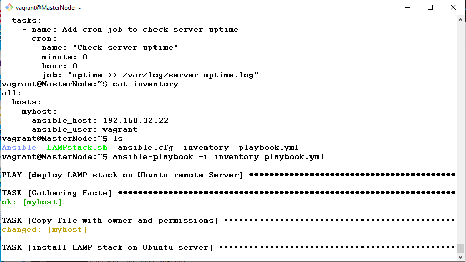

# CLOUD ENGINEERING SECOND SEMESTER EXAMINATION PROJECT

Objective:

### STAGE 1:

PART A
 ## Automate the provisioning of two Ubuntu-based servers, named “Master” and “Slave”, using Vagrant.

 Soln:

```bash
# -*- mode: ruby -*-
# vi: set ft=ruby :

Vagrant.configure("2") do |config|
  config.hostmanager.enabled = true 
  config.hostmanager.manage_host = true
  
  ### Master vm  ####
  config.vm.define "Master_N" do |master_n|
    master_n.vm.box = "ubuntu/focal64"
    master_n.vm.hostname = "MasterNode"
    master_n.vm.network "private_network", ip: "192.168.33.23"
    master_n.vm.provider "virtualbox" do |vb|
    end
  end
  
  ### Slave Node vm  #### 
  config.vm.define "Slave_N" do |slave_n|
    slave_n.vm.box = "ubuntu/focal64"
    slave_n.vm.hostname = "SlaveNode"
    slave_n.vm.network "private_network", ip: "192.168.32.22"
    slave_n.vm.provider "virtualbox" do |vb|
    end
  end
  
end

```


PART B

## On the Master node, create a bash script to automate the deployment of a LAMP (Linux, Apache, MySQL, PHP) stack. This script should clone a PHP application from GitHub, install all necessary packages, and configure Apache web server and MySQL. 

 Soln:


As you can see from the screenshot above, a ping of the slave node IP address was sucessful. With public and private keys generated.


### STAGE 2:

PART A

## Using an Ansible playbook:Execute the bash script on the Slave node and verify that the PHP application is accessible through the VM’s IP addres

soln

on the master node we will install ansible and its dependencies to enable us deploy our automated LAMP script to the slave node

```bash

sudo apt update


sudo apt install python3

sudo apt-get install python3-pip 

sudo apt-add-repository ppa:ansible/ansible

sudo apt update

sudo apt install ansible 

ansible --version command


```

I want to run my playbook as vagrant user so I generate ssh keypair for vagrant user to enable me access the slave server

```bash

ssh-keygen or ssh-keygen -t ed25519 -C "ansible"

```

cat into the public key file and copy the public key and save somewhere

```bash

cat id_rsa.pub

```

now login to the target slave node

```bash

cd .ssh

ls -al

sudo nano authorized_keys

```
paste the copied public key from your ansible machine and save in the authorized_keys text editor


Grant Administrative Privileges to vagrat user or any other admin user

```bash

usermod -aG sudo vagrant
```


```bash

nano /etc/sudoers

```

```bash

vagrant    ALL=(ALL:ALL) NOPASSWD:ALL

```


config sshd file to allow password and key publc key authentication

```bash

nano /etc/ssh/sshd_config

```

we now copy the public keys we generated from the master node to the authorized_key file on the lave node


we logout of slave node and login to the master server. then try to login to the slave via ssh


```bash

ssh vagrant@192.168.32.22

```
Login ws successful as shown below


We have now achieved direct remote connection to the slave node. we will can now deploy our ansible playbook to install the LAMP stack.

we will achieve that by creating arranging our important resources for the task which are;

A. Playbook.yml
B. Inventory File
C. Our Bash script with the \lamp stack installation commandds

My resources are all there on the Project Repository

we deploy the LAMP STACK TO THE SLAVE node via this ansible command


we first of all try an ansible ping of slave node

```bash

ansible all -i inventory --user vagrant -m ping -e "count=2"

```


we are now ready to launch our playbook


ansible-playbook -i inventory playbook.yml




Playbook ran succesfuly and deployed LAMP Stack on the Ubuntu Slave server as shown below;


We will now head to our browser to check if our laravel app was installed correctly;


video proof


<video src="./VID-20240424-WA0000.mp4" width="320" height="240" controls></video>


PART B

## Create a cron job to check the server’s uptime every 12 am.


we need to run the crontab manually to be sure its working before adding it to a script or to the playbook. we first test the crontab for period of every 5 minutes

Open the crontab file for editing:

```bash

crontab -e

```

Add a new line at the end of the file with the following command:


```bash

*/5 * * * * uptime >> /var/log/server_uptime.log

```


now that it worked as shown below;


we will add it to the playbook

```bash

0 0 * * * uptime >> /var/log/server_uptime.log

```

This cron job was appended to the Ansible playbook as show below;


```bash

   - name: Deploy cron job to check server uptime
  hosts: all
  become: true
  tasks:
    - name: Add cron job to check server uptime
      cron:
        name: "Check server uptime"
        minute: 0
        hour: 0
        job: "uptime >> /var/log/server_uptime.log"

```
